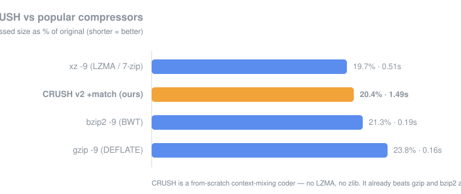

# CRUSH

A from-scratch lossless compressor and archiver. **No zlib, no LZMA, no libraries
— the compression math is ours.** CRUSH is the WinRAR / 7-zip *shape* (a container
that holds many files, each verified with a CRC32) wrapped around a compression
core written from the ground up: a binary range coder driving a **context-mixing**
model with a **match model**.

## Benchmark

On 1 MB of real mixed source code and prose, CRUSH already **beats gzip and bzip2,
and comes within 0.7% of xz / LZMA** — the engine inside 7-zip — despite being a
few hundred lines with no dictionary/LZMA stage at all.



| tool | compressed | ratio | time |
|---|---:|---:|---:|
| xz -9  (LZMA / 7-zip) | 206,960 | 19.7% | 0.51s |
| **CRUSH v2 + match  (ours)** | **213,653** | **20.4%** | 1.49s |
| bzip2 -9  (BWT) | 222,999 | 21.3% | 0.19s |
| gzip -9  (DEFLATE) | 249,040 | 23.8% | 0.16s |

Lower is better. CRUSH trades speed for ratio — it's a bit-at-a-time model, so it's
slower than the LZ tools, but it squeezes harder than all of them bar LZMA.
(`python make_chart.py` regenerates the graph from these numbers.)

## Two implementations

| | file | model | format | speed |
|---|---|---|---|---|
| **C++** (the real one) | `crush.cpp` | context mixing + match model | `CRUSH\x02` | fast |
| **Python** (reference) | `crush.py`, `crush/core.py` | order-1, readable | `CRUSH\x01` | slow, clear |

The Python version is the easy-to-read explanation of the core idea; the C++ version
is the one you'd actually use. (Different models → different formats, so each reads
its own; the Python tool cleanly refuses a v2 archive.)

```bat
:: C++  (build once:  g++ -O2 -std=c++17 -static -o crush.exe crush.cpp)
crush a backup.crush notes.txt report.pdf src\    create / add
crush l backup.crush                              list + ratios
crush t backup.crush                              test integrity (CRC32)
crush x backup.crush out\                         extract

:: Python (same commands)
python crush.py a backup.crush file1 file2 ...
```

## How the compression works

Everything is in `crush.cpp` (and the simpler `crush/core.py`). Three ideas stack up:

### 1. A binary range coder (arithmetic coding)
Each yes/no decision narrows an interval inside a 32-bit number in proportion to how
*likely* the model said that decision was. A bit the model is 99% sure of costs about
**0.014 bits**, not a whole one. This reaches very close to the true information
content (Shannon entropy) of the model's predictions. Carryless 32-bit integer coder
in the fpaq0 lineage — small and exactly reversible.

### 2. Context mixing
The coder needs a probability for every bit. CRUSH runs **several models at once** —
contexts of the previous 1, 2, 3, 4 and 6 bytes — each predicting P(next bit = 1).
Their predictions are blended by a small **adaptive mixer** in the logistic domain
(`stretch → weighted sum → squash`). The mixer's weights learn online, per context,
so models that have been right lately get more say. This is the PAQ / lpaq idea.

### 3. A match model (the dictionary power)
A hash of the last 6 bytes points back to where that context last appeared. While a
match holds, the model predicts the next bit from the byte that *followed last time*,
with confidence that grows the longer the match runs. This gives the mixer the
repeated-string power that LZ tools get from their dictionary — it's what took CRUSH
from 26% down to 20% and past gzip/bzip2.

Encoder and decoder run the identical models and the identical updates, so they stay
in perfect lockstep and **every file round-trips bit-for-bit** (verified on text,
source, random data, tiny and empty files).

## The archive format (`.crush`)

```
"CRUSH\x02"                         magic + model version
uint32  file count
per file:
  uint8   method                    0 = raw, 1 = crush
  uint16  name length
  bytes   name (utf-8)
  uint64  original size
  uint32  CRC32 of the original      (our own CRC table — no zlib)
  uint64  stored size
  bytes   stored data
```

A file is only kept compressed when that's actually smaller; otherwise it's stored
raw, so random or already-packed data never grows. `x`tract and `t`est both check
each file's CRC32.

## Roadmap — closing the last 0.7% to LZMA (and beyond)

1. **SSE / APM** — a secondary estimation stage that refines the mixed probability
   against a small context. Cheap, and usually worth a percent or two.
2. **More / smarter contexts** — sparse contexts, word contexts for text, a second
   match model at a different minimum length.
3. **Two-level mixing** — mix the mixers (an SSE chain), the way the strong PAQ
   variants do, to overtake LZMA on text.
4. **Speed** — the model is bit-at-a-time; SIMD in the mixer and a faster hash would
   narrow the time gap without touching the ratio.

## Files

- `crush.cpp` — the fast compressor: range coder + context mixing + match model (v2)
- `crush/core.py` — the readable reference: range coder + order-1 model (v1)
- `crush.py` — the `.crush` container, CRC32, and the `a / x / l / t` CLI (v1)
- `make_chart.py` — regenerates `docs/benchmark.svg`

---

<!-- DREAM-ECOSYSTEM:START -->
## The DREAM Robotics ecosystem

**Minds** — [DREAM](https://github.com/CursedPrograms/DREAM) companion · [TINA](https://github.com/CursedPrograms/TINA) engineer · [NINA](https://github.com/CursedPrograms/NINA) caretaker · [RIFT](https://github.com/CursedPrograms/RIFT) fleet hub · [LYCEA](https://github.com/CursedPrograms/LYCEA) training school  
**Robots** — [NORA](https://github.com/CursedPrograms/NORA-Robot-v00) · [MILA](https://github.com/CursedPrograms/MILA-Robot-v00) · [WHIP](https://github.com/CursedPrograms/WHIP-Robot-v00) · [KIDA-00](https://github.com/CursedPrograms/KIDA-Robot-v00) · [KIDA-01](https://github.com/CursedPrograms/KIDA-Robot-v01) · [IDA](https://github.com/CursedPrograms/IDA-Robot-v00) · [ARM](https://github.com/CursedPrograms/ARM-Robot-v01)  
**Tools** — [CRUSH](https://github.com/CursedPrograms/CRUSH) compression · [Image-Generator](https://github.com/CursedPrograms/Image-Generator) · [GloriosaAI](https://github.com/CursedPrograms/GloriosaAI) · [SynthWomb](https://github.com/CursedPrograms/SynthWomb) · [PyVitals](https://github.com/CursedPrograms/PyVitals)  
<!-- DREAM-ECOSYSTEM:END -->
